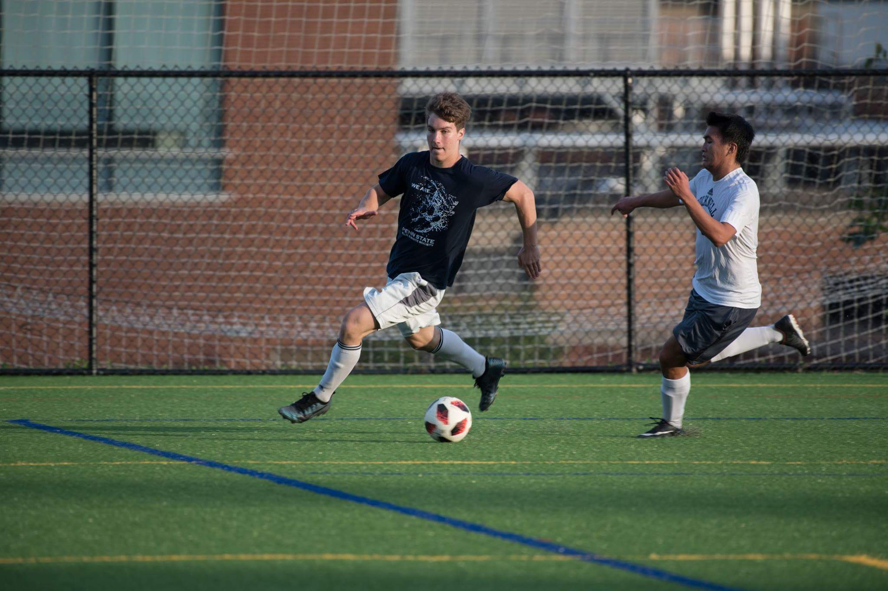

  
---
title: "R Markdown Schedule"
author: "Nick Hatzenbeller"
date: "February 8, 2021"
output:
  html_document:
    df_print: paged
---

# Class Schedule

### PHIL 119: Ethical Leadership

I am currently enrolled in a Philosophy course in which we learn about ethical leadership and what attributes are needed to be an ethical leader. This course is extremely interesting to me because I've always wanted to learn a bit more about philosophy and the works of famous philosophers like Plato and Aristotle. I find it very cool to analyze the thinking of these individuals who lived on earth many years before me. It is amazing to see how they think and be able to connect it with the way that humans think and interact today. It really shows me that even though humans have changed a lot since ancient Greek times, there are still many things that are similar. Overall, we are just getting started in the class but I have already learned a lot by reading Plato's and Aristotle's work (Written by Aristotle: <https://www.stmarys-ca.edu/sites/default/files/attachments/files/Nicomachean_Ethics_0.pdf>). I hope to continue to expand my knowledge into a topic that I was unfamiliar with as the semester goes on. Additionally, being a data science major, I am used to classes that revolve around technology and modern topics, so learning about past philosophers is a nice break.

# Hobbies, etc

### Penn State Men's Club Soccer

The first club that I joined at Penn State was the Penn State Men's Club Soccer Team. I joined the club soccer team my freshman year. I have played soccer since I was around 5 years old, so going into college I knew that I wanted to join a competitive soccer team so that I could continue playing one of my favorite sports at a high level. It was extremely hard to get chosen for the squad, as there were about 400 kids trying out and they only had 10 roster spots open. I knew that I needed to play hard every tryout and do something to get noticed so that I could secure a spot. I was extremely happy when I found out I made the team and I knew all my hard work paid off. Joining the club team was a great choice as it helped me make friends during my first semester and it also helped keep me in shape since we practiced four times a week and had games on the weekend. Unfortunately, due to COVID-19, we have not been able to have a real season or hold practices, so I haven't been able to play soccer at a high level as much as I'd like to this semester. However, next year, I am hoping that everything returns back to normal so that I can continue to play the game I love. (Org Central Website:  <https://orgcentral.psu.edu/organization/soccer--men>).

### Church Band

Life is busy with young kids, so I don't keep up with quite as many hobbies as I used to, but one that I particularly enjoy is playing drums occasionally at my church.  When my wife and I moved to State College for my job at Penn State, we began attending Calvary Church and wanted to find ways to volunteer (<https://www.calvarysc.org/>).  Lots of churches begin and end weekend gatherings with a few songs; some churches have a choir, some just have one person and a piano, but our church (and many others) has a band of volunteers playing drums, guitars, piano, etc.  After attending regularly for a while, I noticed that several volunteers were taking turns playing piano, guitar or singing, but the same guy (Mike) was always playing the drums every single week.  Sometimes, he would be gone but the band would then play with no drums at all!  After a few months of this, I talked to the person who organized the band and explained that I never thought myself particularly talented but I know my around a drum set enough to at least give Mike a break once in a while.  So, every 4-6 weeks for the last couple of years I get a turn!

